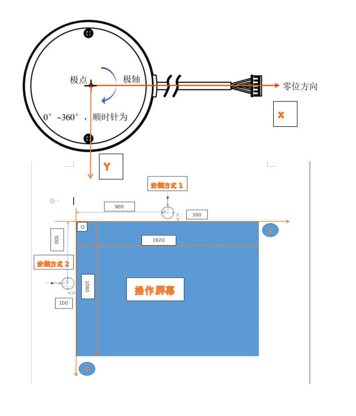

YDLIDAR SDK BIG SCREEN INTERACTION PACKAGE V1.1.3
=====================================================================

SDK [test](https://github.com/yangfuyuan/sdk/tree/big-screen) application for YDLIDAR

Visit EAI Website for more details about [YDLIDAR](http://www.ydlidar.com/) .

How to build YDLIDAR SDK samples
=====================================================================
    $ git clone https://github.com/yangfuyuan/sdk
    $ cd sdk
    $ git checkout big-screen
    $ cd ..

###linux:

    $ mkdir build

    $ cd build

    $ cmake ../sdk

    $ make			###linux

###windows:

1. install [cmake](https://cmake.org/download/)

2. build steps:

  step1: open cmake-gui and select source code/binaries directory

  

      
  

  step2: Configure and select build toolchain

  

      
  

  step3: configuring done  

  

      
  
         

  step4: generate and done

  

      
  

  step5: open vs Project

  

      
  

  step6: build finished and run

   

       
   

How to run YDLIDAR SDK samples
=====================================================================
    $ cd samples

linux:

    $ ./ydlidar_test
    $请输入串口号或雷达IP: /dev/ttyUSB0
    $请输入雷达波特率或网络端口:230400

windows:

    $ ydlidar_test.exe
    $请输入串口号或雷达IP: COM3
    $请输入雷达波特率或网络端口::230400

You should see YDLIDAR's scan result in the console:

    Yd Lidar running correctly ! The health status: good
    [YDLIDAR] Connection established in [/dev/ttyUSB0]:
    Firmware version: 2.0.9
    Hardware version: 2
    Model: G4
    Serial: 2018041400000102
    [YDLIDAR INFO] Current Sampling Rate : 9K
    [YDLIDAR INFO] Current Scan Frequency : 7.400000Hz
    [YDLIDAR INFO] Now YDLIDAR is scanning ......

Upgrade Log
=====================================================================

2018-12-21 version:1.1.3

   1.fix network auto connecting.

2018-10-11 version:1.1.2

   1.add network support.

2018-05-23 version:1.1.1

   1.add auto connection for an exception.

   2.add seril file lock.

2018-05-05 version:1.1.0

   1.increase mouse event c++ mutil-platform library.

   2.remove python mouse event.

   3.add simple right mouse button, left button, middle button demo.

2018-05-02 version:1.0.0

   1.Output screen corrdinates.

坐标系统
=====================================================================

    

参数设定样例:

上图安装方式1:

	屏幕X轴最小值 = 0mm;

	屏幕 Y 轴最小值 = 0mm;

	屏幕X轴最大值 = 1920mm;

	屏幕Y轴最大值 = 1080mm;

	雷达安装位置X值 = 900mm;

	雷达安装位置Y值 = -100mm;

	雷达安装角度Theta = -90;//雷达坐标系相对屏幕坐标系逆时针旋转了90度.

	CYdLidar laser;

	laser.setMax_x(1920);

	laser.setMax_y(1080);

	laser.setMin_x(0);

	laser.setMin_y(0);

	LaserPose pose;

	pose.x = 900;

	pose.y = -100;

	pose.theta = -90;

	pose.reversion = false; //雷达表面朝外

	laser.setpose(pose);

上图安装方式2:

	屏幕X轴最小值 = 0mm;

	屏幕 Y 轴最小值 = 0mm;

	屏幕X轴最大值 = 1920mm;

	屏幕Y轴最大值 = 1080mm;

	雷达安装位置X值 = -100mm;

	雷达安装位置Y值 = 500mm;

	雷达安装角度Theta = -180;//雷达坐标系相对屏幕坐标系逆时针旋转了180度.

	CYdLidar laser;

	laser.setMax_x(1920);

	laser.setMax_y(1080);

	laser.setMin_x(0);

	laser.setMin_y(0);

	LaserPose pose;

	pose.x = -100;

	pose.y = 500;

	pose.theta = -180;

	pose.reversion = false; //雷达表面朝外

	laser.setpose(pose);

####备注:雷达安装位置和角度根据实际情况设定, 注意实际屏幕和操作屏幕的换算比例. 如果安装角度是120度, 直接把雷达安装角度设置为120, 不用更改雷达零点.
请输入串口号或雷达IP:
